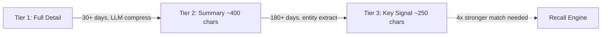

export const metadata = {
  title: 'Tiered Episodic Degradation: Gradual Memory Compression',
  description: 'Mnemosyne supports three-tier degradation so episodic memories persist indefinitely without bloat. Hot, warm, and cold tiers keep old memories queryable at reduced priority.',
  openGraph: { images: ['/og-image.svg'] },
  twitter: { card: 'summary_large_image' },
};

# Tiered Episodic Degradation

Mnemosyne supports three-tier degradation so episodic memories persist indefinitely without bloat. Old memories never get deleted, they gracefully fade into compact, lower-priority signals that still surface when the query really matters.

## Tier Definitions

- **Tier 1 (hot, 0 to 30 days):** Full detail, 1.0x recall weight. These are your working, active memories.
- **Tier 2 (warm, 30 to 180 days):** LLM-compressed summary, roughly 400 characters. Half the recall weight.
- **Tier 3 (cold, 180+ days):** Entity-extracted signal, roughly 200 to 300 characters. Quarter the recall weight.

## The Degradation Flow



## How It Works

Degradation runs automatically at the end of each `sleep()` cycle, right after consolidation completes. No separate cron jobs, no manual pruning.

### Tier 1 to Tier 2

Memories older than the configured threshold (default 30 days) get compressed by a local LLM into a roughly 400-character summary. If no LLM is available, the system falls back to keeping the raw text so nothing is lost.

### Tier 2 to Tier 3

Memories older than 180 days undergo deep signal extraction via `_extract_key_signal()`. Instead of naive first-N-characters trimming, this function scores every sentence by entity density: proper nouns, acronyms, security terms, tech stack keywords, and urgency markers. It keeps the highest-scoring sentences until the character budget is full. A memory where the critical fact is buried in the last sentence preserves that sentence instead of only the boring first one.

### Recall Weight Multipliers

- Tier 3 memories need roughly 4x stronger semantic match to surface compared to Tier 1
- Tier 2 memories need roughly 2x stronger match
- Old memories stay out of your way unless the query is genuinely relevant

## Configuration

All knobs are environment variables:

```bash
MNEMOSYNE_TIER2_DAYS=30        # Days before tier 1 -> 2
MNEMOSYNE_TIER3_DAYS=180       # Days before tier 2 -> 3
MNEMOSYNE_TIER1_WEIGHT=1.0     # Recall multiplier for tier 1
MNEMOSYNE_TIER2_WEIGHT=0.5     # Recall multiplier for tier 2
MNEMOSYNE_TIER3_WEIGHT=0.25    # Recall multiplier for tier 3
MNEMOSYNE_DEGRADE_BATCH=100    # Max rows per cycle
MNEMOSYNE_SMART_COMPRESS=1     # Enable entity-aware extraction
MNEMOSYNE_TIER3_MAX_CHARS=300  # Max chars for tier 3
```

## Python API

```python
from mnemosyne import Mnemosyne

mem = Mnemosyne(session_id="default")

# Run degradation manually
result = mem.degrade_episodic()
print(result)  # {"tier1_to_tier2": 5, "tier2_to_tier3": 12}

# Dry run to preview
dry = mem.degrade_episodic(dry_run=True)

# During sleep, degradation runs automatically
result = mem.sleep()
print(result["degradation"])  # {"tier1_to_tier2": 3, "tier2_to_tier3": 8}
```

## Design Intent

**Marketing truth:** "Mnemosyne remembers what I told it a year ago." Tier 3 memories are still queryable, just at reduced priority.

**Engineering reality:** Cold memories do not clutter everyday context. They only surface with very strong semantic matches.

**Zero maintenance:** No manual pruning scripts, no cron jobs. The system degrades itself during sleep cycles.

**Backward compatible:** Existing databases work without migration. Old rows default to Tier 1.

## Smart Compression Detail

The `_extract_key_signal()` function scores every sentence by signal density:

- **Acronyms** (XKCD, API, AWS): +3
- **Known tech terms** (Docker, Python, Rust): +4
- **Security terms** (password, token, encrypt): +3
- **Infrastructure terms** (production, deploy, database): +2
- **Urgency signals** (critical, breaking, incident): +3
- **Preference markers** (prefers, uses, likes): +2

Sentences are ranked by total score, top scorers kept until character budget is exhausted. A critical security finding in the final paragraph gets preserved, not truncated.

**Why not just first N characters?** Naive truncation assumes importance lives at the top. Real conversations bury critical facts deep. Smart compression finds the signal no matter where it hides.

## Sleep Integration

`degrade_episodic()` runs at the end of both `sleep()` and `sleep_all_sessions()`, after consolidation. Stats included under the `"degradation"` key.

## How It Compares

- **vs Vector DB TTL:** Automatic degradation vs manual cleanup. No data loss vs hard deletion after expiry.
- **vs Full-text pruning:** Smart entity-aware extraction vs naive first-N-characters. Critical sentences survive.
- **vs Archive-only approaches:** Tier 3 remains queryable at reduced weight vs moved to cold storage, unsearchable.

## Related

- [Sleep Consolidation](/architecture/sleep-consolidation)
- [AAAK Compression](/architecture/aaak-compression)
- [Data Flow](/architecture/data-flow)
