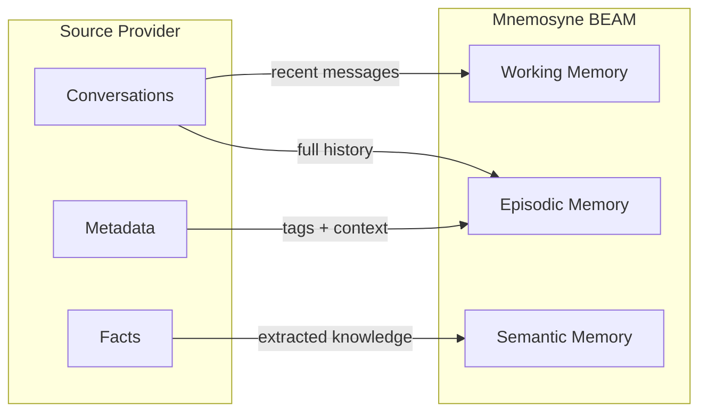

export const metadata = {
  title: 'Cross-Provider Migration — Import from Other Memory Providers',
  description: 'Migrate your AI agent memories from Mem0, Letta, Zep, Cognee, MemGPT, and LangMem into Mnemosyne v2.2 with the cross-provider importer.',
  openGraph: {
    images: ['/og-image.svg'],
  },
  twitter: {
    card: 'summary_large_image',
  },
};

# Cross-Provider Migration

Mnemosyne v2.2 introduces **Cross-Provider Importers** — a unified migration system that imports memory data from six popular AI memory providers. Whether you're moving from a cloud service or another open-source library, Mnemosyne makes the transition seamless.

## Supported Providers

Mnemosyne v2.2 supports importing from **six** external memory providers:

| Provider | Import Method | Notes |
|----------|-------------|-------|
| **Mem0** | `mnemosyne import mem0` | Full conversation history + metadata |
| **Letta** | `mnemosyne import letta` | Agents, blocks, and archival memory |
| **Zep** | `mnemosyne import zep` | User sessions, facts, and summaries |
| **Cognee** | `mnemosyne import cognee` | Graph memory with relationship triples |
| **MemGPT** | `mnemosyne import memgpt` | Legacy MemGPT conversations and recall |
| **LangMem** | `mnemosyne import langmem` | LangChain memory checkpoints and state |

## How It Works

Each importer follows a consistent pattern:

1. **Connect** — authenticate with the source provider (API key, local DB path, etc.)
2. **Extract** — read memories, metadata, and relationships
3. **Transform** — map source schemas to Mnemosyne's BEAM architecture (Working → Episodic → Semantic)
4. **Import** — write into your Mnemosyne SQLite database with full fidelity

### Quick Start

```bash
# Install with cross-provider import support
pip install mnemosyne-memory[importers]

# Import from your existing provider
mnemosyne import mem0 --api-key $MEM0_API_KEY
```

### Programmatic Import

```python
from mnemosyne import Mnemosyne
from mnemosyne.importers import Mem0Importer

mem = Mnemosyne()
importer = Mem0Importer(api_key="...")
importer.import_to(mem)

print(f"Imported {mem.stats()['total_memories']} memories")
```

## Choosing a Provider Guide

Detailed migration guides for major providers:

- **[From Mem0 → Mnemosyne](/migration/from-mem0)** — Cloud-to-local migration
- **[From Letta → Mnemosyne](/migration/from-letta)** — Agent memory portability
- **[From Zep → Mnemosyne](/migration/from-zep)** — Session and fact migration

For Cognee, MemGPT, and LangMem, the import pattern is identical to the guides above — just substitute the provider name in the CLI command.

## Data Mapping Reference

Each provider has its own data model. Mnemosyne maps them to BEAM tiers:



## After Migration

Once your data is imported:

1. **Verify** — run `hermes mnemosyne stats` to confirm all memories landed
2. **Search** — test vector + FTS5 hybrid retrieval on your old data
3. **Sleep** — trigger sleep consolidation to optimize your imported memories
4. **Backup** — create a snapshot of your migrated database

```bash
# Verify import
hermes mnemosyne stats

# Trigger consolidation
python -c "from mnemosyne import Mnemosyne; Mnemosyne().sleep()"

# Backup the migrated DB
cp ~/.hermes/mnemosyne/data/mnemosyne.db ~/migration-backup.db
```

## Troubleshooting

### API Authentication Errors

Most providers require API keys. Set them via environment variables:

```bash
export MEM0_API_KEY="m0-..."
export ZEP_API_KEY="z_..."
export LETTA_API_KEY="lt-..."
```

### Large Dataset Imports

For providers with >100K memories, use batch mode:

```bash
mnemosyne import mem0 --batch-size 1000 --api-key $MEM0_API_KEY
```

### Schema Conflicts

If source memories conflict with existing Mnemosyne data, use `--skip-existing` or `--overwrite`:

```bash
mnemosyne import zep --skip-existing  # Skip duplicates
mnemosyne import zep --overwrite       # Replace conflicting records
```
